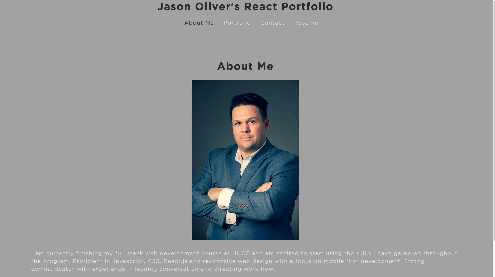

# React Portfolio

## Description

I created this React based Portfolio to display my abilities in react as well as previous work I have complete. I also included a resume page and a contact page in case somebody would like to reach out to me.

## How to Use React Portfolio App

To install clone the repository and open in vs code. This application requires bootstrap and react. After cloning the repository run npm install to install the dependencies. Finally type npm start in the terminal and the page will open upon server start.

### Languages and Tools:

#  

## React Portfolio Live Site

-   [React Portfolio Live Site](https://joliver521.github.io/react-portfolio/)

## GitHub repository for challenge 20

-   [Github React Portfolio Repo](https://github.com/joliver521/react-portfolio)
